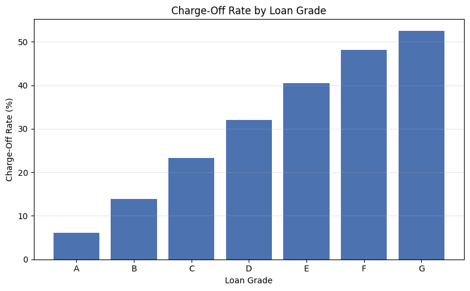
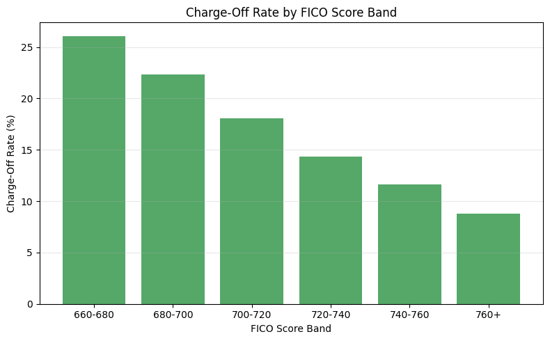
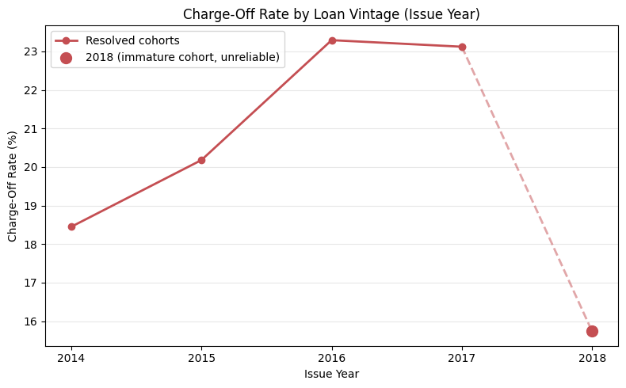
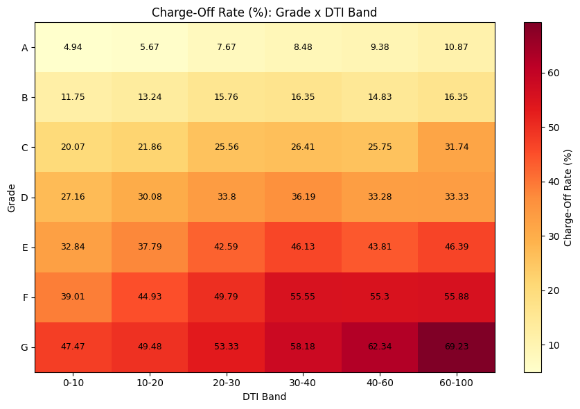
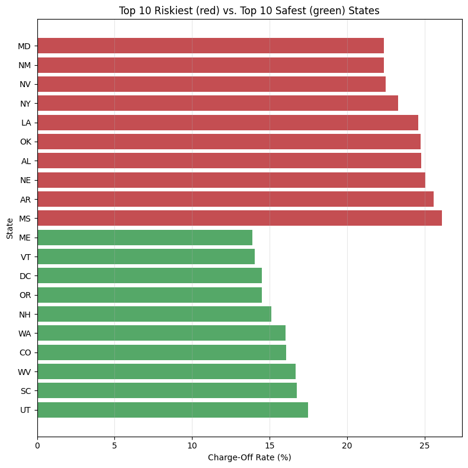
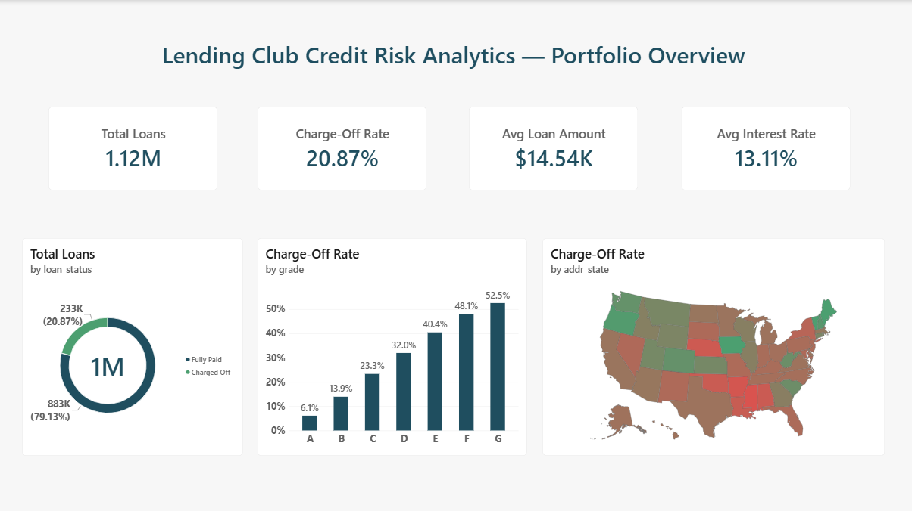
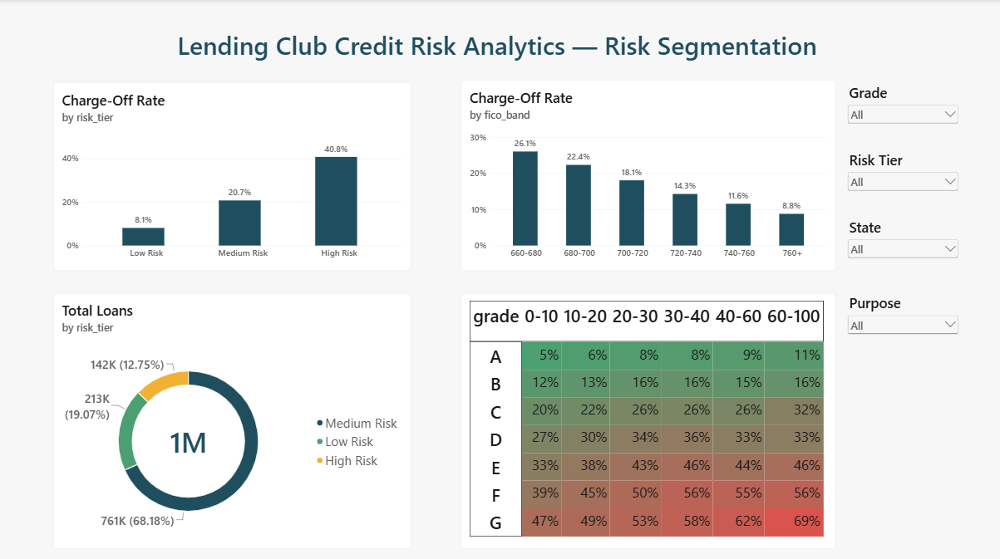
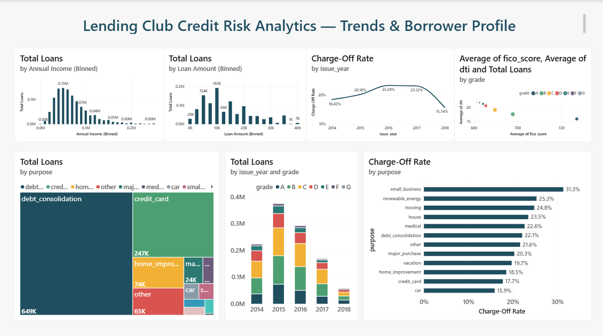
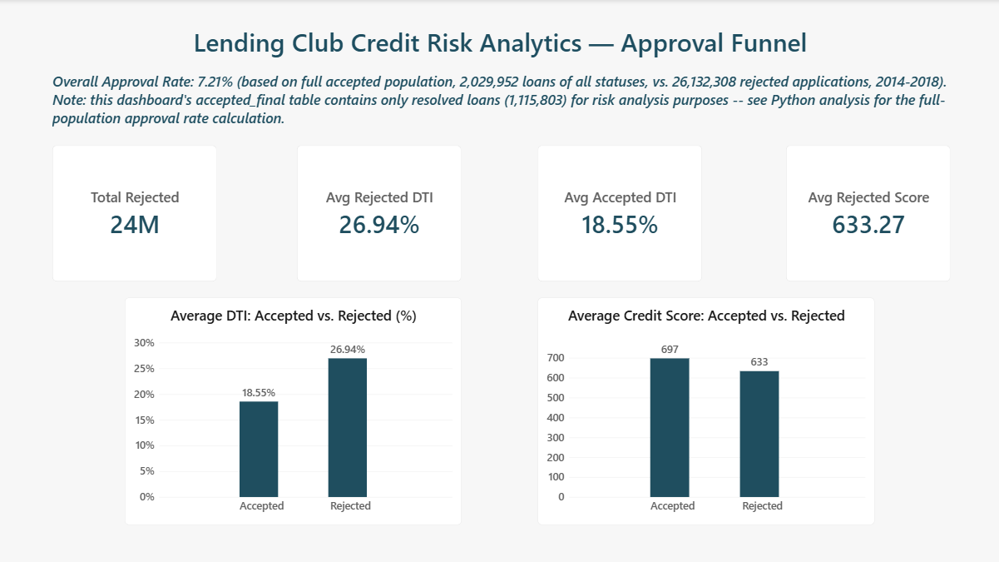

# LendingClub Credit Risk Analytics

**A fintech credit risk and lending analytics project** — analyzing LendingClub's historical loan portfolio to identify default risk drivers, evaluate the platform's own risk grading, and compare accepted vs. rejected applicants.

Built as a data analyst / business analyst portfolio project, deliberately scoped around business-driven analysis and clear storytelling rather than predictive modeling.

**Author:** Nikhil Pallam
**Tech stack:** Python (pandas, matplotlib) → MySQL → Power BI

---

## Business Problem

Acting as an analyst for a lending business's Head of Credit Risk, this project answers five core questions:

1. Which borrower segments (grade, purpose, income band, DTI, employment length) drive the majority of charge-offs?
2. Is default risk concentrated in specific loan vintages, suggesting the portfolio's risk profile is drifting over time?
3. Is LendingClub's own risk grading well-calibrated to actual default outcomes?
4. How does the rejected-applicant pool compare to accepted applicants — is the approval process consistent?
5. What early, business-interpretable signals best separate loans that default from those that don't?

**Key KPIs tracked:** charge-off rate (overall and by segment), default rate by vintage cohort, approval rate, average interest rate vs. actual default rate by grade, portfolio composition.

---

## Dataset

Source: [LendingClub Loan Data (Kaggle)](https://www.kaggle.com/datasets/wordsforthewise/lending-club) — real loan application and performance data, 2007–2018.

| File | Rows (raw) | Rows (used) | Description |
|---|---|---|---|
| Accepted loans | ~2.26M | 1,115,803 | Full loan lifecycle: borrower financials, credit history, loan terms, outcome |
| Rejected loans | ~27.6M | 24,191,792 | Minimal detail: amount requested, risk score, DTI, state, employment length |

### Scoping decisions

- **Date range: 2014–2018.** Balances dataset size against recency, avoiding the thin, atypical early platform years (2007–2012).
- **Resolved loans only** (Fully Paid / Charged Off / Default). A loan's outcome can't be known until it's finished, so loans still marked "Current" (~878K excluded) can't be labeled for risk analysis. They were analyzed separately where relevant.
- **`Default` merged into `Charged Off`.** Only 40 loans (0.004%) — too rare to analyze separately, and economically equivalent (borrower failed to repay).
- **~26 working columns**, selected from the raw 151, restricted to fields known at loan-approval time. Payment-history fields (`total_pymnt`, `recoveries`, etc.) were deliberately excluded — they only exist after a loan starts performing well or badly, so including them would leak information not available at the time of the actual approval decision.

### Data quality handling

| Issue | Decision | Reasoning |
|---|---|---|
| `emp_length` missing (6.22%) | Kept as explicit "Unknown" category | Missingness may itself be a risk signal (e.g. self-employed/gig workers); imputing a guess would erase that signal |
| `revol_util` / `dti` missing (<0.1%) | Dropped | Negligible size, no meaningful data loss |
| Invalid `dti` values (negative, >100%) | Dropped (535 rows) | Not realistic lending scenarios — data entry errors |
| Rejected-loan `dti` extreme outliers (up to 7.3M%) | Capped to 0–100% range | Rejected applications are unvalidated/unverified self-reports, unlike underwritten accepted loans |
| Rejected-loan `Risk_Score` missing (70.6%) | Left as NULL, documented | Likely reflects early-stage/incomplete rejections that never reached a credit pull |

---

## Key Findings

### 1. LendingClub's grading is well-calibrated

Charge-off rate climbs steadily and almost linearly from Grade A (6.10%) to Grade G (52.55%).



### 2. FICO score is the strongest single predictor

A ~3x spread between the riskiest and safest FICO bands, cleanly monotonic.



### 3. Vintage trend — with a data-integrity caveat

Charge-off rate rose from 18.45% (2014) to ~23% (2016–2017). The apparent drop in 2018 (15.74%) is **not real risk improvement** — it's a right-censoring artifact. Most 2018 loans (36–60 month terms) haven't had time to resolve by this dataset's snapshot cutoff, so only unusually fast payoffs or very early defaults appear as "resolved" for that cohort.



### 4. DTI adds risk signal beyond grade alone

Testing whether debt-to-income ratio still matters once grade is already known: charge-off rate rises with DTI **within every single grade** — Grade A ranges from 4.94% to 10.87% across DTI bands; Grade G ranges from 47.47% to 69.23%. This proves DTI carries independent predictive value, not fully captured by grade.



### 5. Geography reveals an unexplained anomaly

Charge-off rate ranges from ~14% (Maine) to ~26% (Mississippi), with riskier states clustering in the South. New York stands out: a large, reliable sample (89,676 loans) shows an elevated 23.30% rate — but follow-up analysis found this is **not** explained by grade mix or purpose mix (both nearly identical to the national average). This points to unobserved regional factors outside this dataset's scope.



### 6. A custom, explainable risk segmentation

Rather than a black-box model, a transparent point-based score was built from the three strongest predictors (Grade, FICO, DTI), weighted by their demonstrated predictive strength:

| Risk Tier | Score Range | Charge-Off Rate | Loans |
|---|---|---|---|
| Low Risk | 0–4 | 8.09% | 213K (19%) |
| Medium Risk | 5–9 | 20.73% | 761K (68%) |
| High Risk | 10–16 | 40.75% | 142K (13%) |

A clean ~5x spread between tiers, confirming the segmentation genuinely separates risk. Credit history length was deliberately excluded from the score — it proved a comparatively weak predictor on its own.

### 7. The approval funnel: a highly selective platform

Comparing the full accepted population (2,029,952 loans, all statuses) against rejected applications (26,132,308) over the same period:

**Overall approval rate: 7.21%**

Rejected applicants show meaningfully worse risk profiles on average — DTI 26.94% vs. accepted's 18.55%; credit score 633 vs. accepted's 697 — but with substantial overlap between the two populations, meaning no single hard cutoff explains the accept/reject decision.

---

## Power BI Dashboard

A 4-page interactive dashboard built on the cleaned analysis outputs, using DAX measures throughout rather than static values.

### Page 1 — Portfolio Overview


### Page 2 — Risk Segmentation
Interactive matrix (Grade × DTI heatmap) with conditional formatting, plus slicers for Grade, Risk Tier, State, and Purpose.



### Page 3 — Trends & Borrower Profile


### Page 4 — Approval Funnel
Note the explicit scope callout on this page: the accepted-loans table used throughout this dashboard contains only *resolved* loans (1.1M), not the full accepted population — the true 7.21% approval rate (computed correctly in the Python analysis, which had access to the unfiltered accepted-loan count) is stated as a reference rather than recalculated from mismatched-scope tables.



---

## SQL Analysis

Five queries (`sql/queries.sql`) re-deriving core findings in SQL — table creation, data loading, aggregation with `HAVING` filters, a `RANK()` window function, and a cross-table `UNION ALL` comparison. All results verified to match the Python analysis exactly.

Notably, an approval-rate query was **deliberately excluded** from the SQL layer after recognizing the same table-scope mismatch (resolved-only accepted loans vs. full rejected population) — documented directly in the SQL file rather than presenting a misleading number.

---

## Repository Structure

```
lendingclub-credit-risk-analytics/
├── README.md
├── notebooks/
│   └── LendingClub_Credit_Risk_Analysis.ipynb    # Full Python analysis, executed with outputs
├── sql/
│   └── queries.sql                                # Table setup + 5 analysis queries
├── powerbi/
│   └── Lending_Club_Credit_Risk_Analytics.pbix    # 4-page interactive dashboard
├── images/                                         # Chart exports used in this README
└── data/
    └── README.md                                   # Data source + instructions to reproduce
```

Raw and processed data files are not committed to this repository due to size (the accepted-loans dataset alone exceeds 250MB). See `data/README.md` for instructions to download the source data and reproduce the cleaned outputs via the notebook.

---

## Methodology Notes & Scope

- **No predictive ML model.** A simple bonus model (logistic regression) was considered and deliberately excluded. The manual, business-driven risk segmentation above already provides a strong, fully explainable result appropriate for a data analyst / business analyst portfolio, without the added complexity and validation burden of a model.
- **Minimum sample size filtering.** Categories with fewer than 100 loans (e.g., `wedding`, `educational` loan purposes) were excluded from rate-based comparisons throughout — in Python, SQL, and Power BI — since a rate computed from a handful of loans isn't statistically meaningful.
- **Excel was scoped out of this project.** Excel competency is demonstrated in a separate portfolio project (an ad-campaign performance dashboard); this project's tool stack focuses on Python, SQL, and Power BI instead.

---

## How to Reproduce

1. Download `accepted_2007_to_2018Q4.csv.gz` and `rejected_2007_to_2018Q4.csv.gz` from the [Kaggle source](https://www.kaggle.com/datasets/wordsforthewise/lending-club).
2. Run `notebooks/LendingClub_Credit_Risk_Analysis.ipynb` top to bottom to reproduce the cleaned datasets (`accepted_final.csv`, `rejected_final.csv`) and all findings/charts.
3. Load the cleaned CSVs into MySQL using `sql/queries.sql` (update the file paths at the top of the script).
4. Open `powerbi/Lending_Club_Credit_Risk_Analytics.pbix` in Power BI Desktop and point it at the same cleaned CSVs to refresh the data model.
